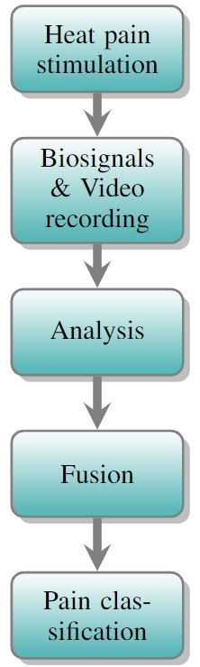

# Pain Recognition: Dataset analysis and experimental validation

## About the project
This is a unified project for the courses Affective Computing and Natural Interaction at [PhuseLab](https://phuselab.di.unimi.it/), University of Milan, A.Y. 2021/2022.

The aim of this project is to test the accuracy of early and late fusion approaches on a multi-modal dataset to classify the presence of pain in patients. Participants were subjected to an external heat-pain stimulus through a physical device.

Their facial expressions and biophysical signals were recorded using cameras and the application of electrodes, then features were extracted. The descriptors came from two different modalities and will be combined by testing both fusion approaches. Finally, classifications and accuracy estimates were made, based on which it was possible to determine that early fusion is the most accurate approach for the dataset considered.
* For more information about the project download the [report](Pain_Detection_Manuel_Pagliuca_AC_NI_2022.pdf).

    

Pain stimulation occurs in patients through electrostimulators applied to the wrists. When this experiment is performed different biopotential signals (GSR, EMG, ...) and facial expressions are recorded through (through a video camera).

The analysis phase involves extracting features from the video signals through computer vision techniques. The features involved are Euclidean distances on particular facial landmarks and gradients on 5 regions of the face.

Once the biopotential signals and video features are ready, fusion techniques are used to perform classification.
- **Early fusion** involves fusing signals and video features a priori concerning classification. Then train the classifier on the combined inputs.
- **Late fusion** involves training three classifiers (of the same type) on different inputs (ECG, GSR, and video), then for each sample in the testing set its prediction is calculated with all three classifiers. The majority prediction is considered; if that prediction coincides with the *ground truth*, then that prediction is considered correct.

The classifier used in this project was *Support Vector Machines*.

### Video feature extraction
## Tools
* IntelliJ IDEA and Python for developing the project application.
* Microsoft Excel for working with the `.csv` files.
* [BioVid](https://ieeexplore.ieee.org/document/6617456) dataset.

## Dependencies
* OpenCV
* MediaPipe
* Sk-learn
* Numpy

## Computer vision techniques
The computer vision techniques used were for the extraction of facial distances, gradients of facial folds, and head position.

### Facial distances and head pose estimation

### Gradient for face folds
Gradients allow changes in regions of the face to be assessed. An arithmetic average of pixel values in these regions is calculated.
This average is again weighted by the number of frames in the video window(which in the dataset was 5 seconds).

### Switch button
There is a debug branch called `cv-features` in this repository where you can try computer vision systems directly with your computer camera. Using the tab key you can enable and disable debugging for gradients.

## Ideas for future extensions
- Calculate the gradient only when the pain stimulus is activated and not over the entire window.
- ...
